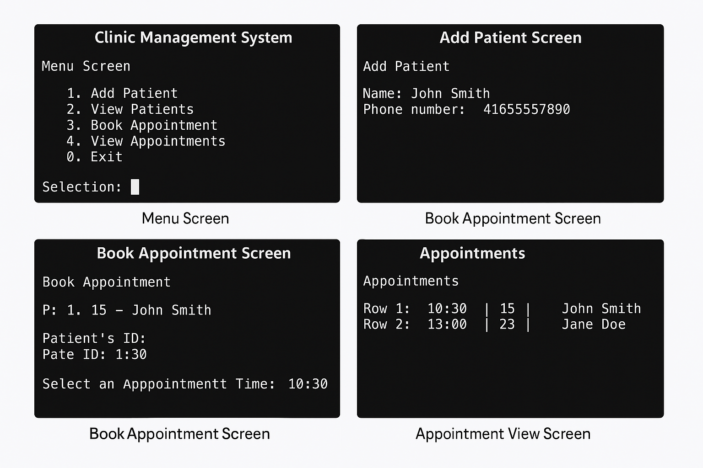

# Clinic Management System 🏥 (C Language)

A C-based console application created with care to simulate a simplified clinic’s patient and appointment management system.  
Built during my programming fundamentals course using structured design principles, modular header/source files, and user-driven interaction.

---

## 🧠 Key Features

- ➕ Add, edit, and remove patient records  
- 🕙 Book appointments within working hours (10 AM – 2 PM, 30-min slots)  
- 📅 Display all appointments or filter by date  
- 📁 Import/export from `txt` files  
- 🧭 Full console UI with structured navigation

---

## 🛠️ Tech Stack

- C (Structured Programming)
- Header files for modularity
- Standard I/O and `stdio.h`
- File I/O and static memory allocation

---

## 📸 Screenshots

> Here's a glimpse of the terminal UI and program output:



---

## 🗃️ Files Included

- `core.c` / `core.h` – Input validation, utility functions  
- `clinic.c` / `clinic.h` – Patient & appointment logic  
- `a1ms3.c` – Main application entry point  
- `data/patientData.txt` & `data/appointmentData.txt` – Sample data  
- `media/` – Screenshots and visuals  

---

## 📥 How To Run

```bash
gcc src/a1ms3.c src/clinic.c src/core.c -o clinicApp
./clinicApp
```

💡 Created with care and caffeine ☕ by Kemono
